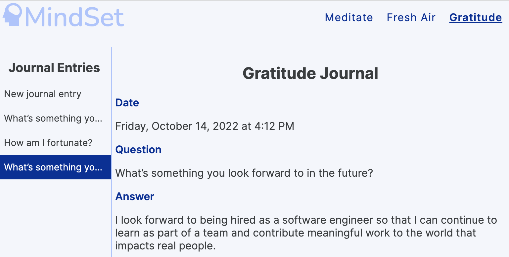

# Mindset
## A mental health web app in React

by Hope Neels

## How to run
You can run this on your own machine by cloning this repo, running "npm install" to install the dependencies listed in package.json, and serving on your localhost with Live Server, MAMP, or equivalent. However, you'll need to create your own API keys for the RapidAPI Gratitude API [here](https://rapidapi.com/sammacfarlane23/api/gratitude-questions/) and Google Maps/ Google Places APIs [here](https://developers.google.com/maps/documentation/javascript/get-api-key). An easier option is to check out this app where it's hosted on Netlify: https://mindset-wellness.netlify.app/

## Home page: Meditate

The home page of this app is a meditation zone where users can choose between Rainforest, Pink Noise, and Ocean Waves soundtracks. The audio loops for an uninterrupted meditation experience. Pressing play begins a meditation timer and starts the audio (though users can switch between audio choices midway through the meditation). Pressing stop ends the timer and audio, displaying the total elapsed meditation time.

## Fresh Air page: Find Nearby Parks

Clicking "Fresh Air" in the navbar takes you to a park locator. Users must allow browser geolocation for this page to work as expected. The app retrieves the user's coordinates and interfaces with the Google Maps API to display their location on a map with a marker, then leverages the Google Places API's Nearby Search request to display the five parks closest to their location, with clickable/closable info windows containing the park's name and vicinity. It's important that this page uses the Nearby Search request rather than Find Place request, so that only places of *type* park are displayed (and not, say, parking lots).

## Gratitude Journal page

The third page of this app is a gratitude journal which pulls a random question designed to inspire feelings of gratitude from the RapidAPI endpoint linked above. Users can reflect on the question and save their written response to the journal.

Saved journal entries are retained in LocalStorage so users can review their past answers. Saving a completed journal entry loads a new question from the API. When saved journal entries exist in LocalStorage, the app layout changes so users can toggle between past entries and new submissions.

## Topics and Technologies

The following are topics and tools from Boston University's MET CS701 that are incorporated into this project, as well as some topics I studied on my own from https://scrimba.com and YouTube. 

**Module 1 topics**

* HTML audio elements and methods (home page)
* SVGs: I used a converter for creation, but then modified them with colors and filters, using knowledge from Module 1. (throughout app: nav bar, home page, parks page)
* Advanced JavaScript: IIFEs, Date objects, JSON.parse/ stringify (journal page)

**Module 2 topics**
* LocalStorage (journal page)
* Geolocation API (parks page)
* Google map API and adding markers (parks page)
* setTimeout and setInterval (home page)

**Module 3-5 topics**
* Event and data binding in front-end frameworks (whole app)
* Framework components (whole app)
* Parent-child component interaction (props in React) (parks and journal pages)
* Processing form data in front-end frameworks (home page, journal page)
* Fetching from APIs: Google Places API, gratitude API (parks page, journal page)
* SPA routing in front-end frameworks (Nav component, App component)

**Other**
* React, react-router-dom, and react-google-maps/api
* mobile-responsive flexible layout and accessibility

## Resources

Thanks to the following tutorials for helping me learn about React and react-google-maps/api:

* https://scrimba.com/learn/learnreact
* https://youtu.be/iP3DnhCUIsE

## BU Academic Conduct Code

Please note that this was a final project for BU MET CS701. I encourage you to explore it and use any pieces you find useful, but copying any portion and submitting it as your own work is a violation of Boston University's academic conduct code. Thanks for understanding!